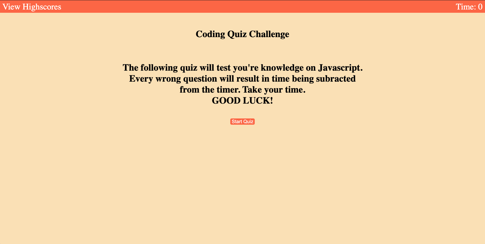
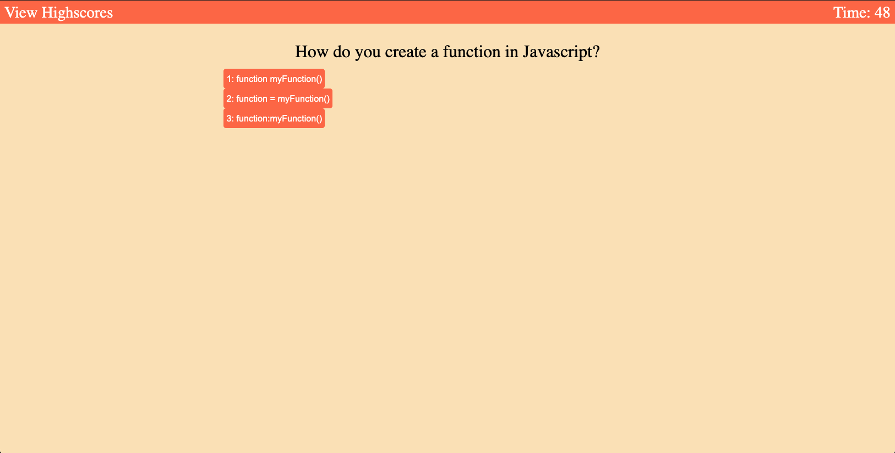

# Javascript-Quiz

# Description
    
    * This is a Javascript Quiz that test you're knowledge on Javascript. Meant for
     fellow classmates to take the quiz and 
     judge if their knowledge is sufficient.

# Code Description

    * After the start button is pressed you will be prompted with you're first question, simultaneously the timer begins.
    * With each correct answer the next question will appear.
        * if question is answered incorrectly, there will be time removed from the timer.
    * After all questions are complete, scores can be saved.
    * Scores will be available to check after they have been saved.
        * Using Local Storage

# Screenshot of Website

